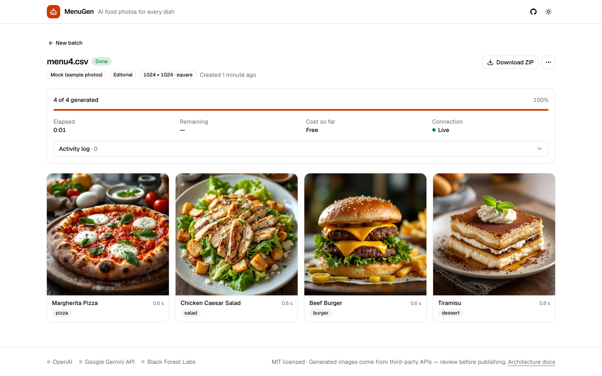
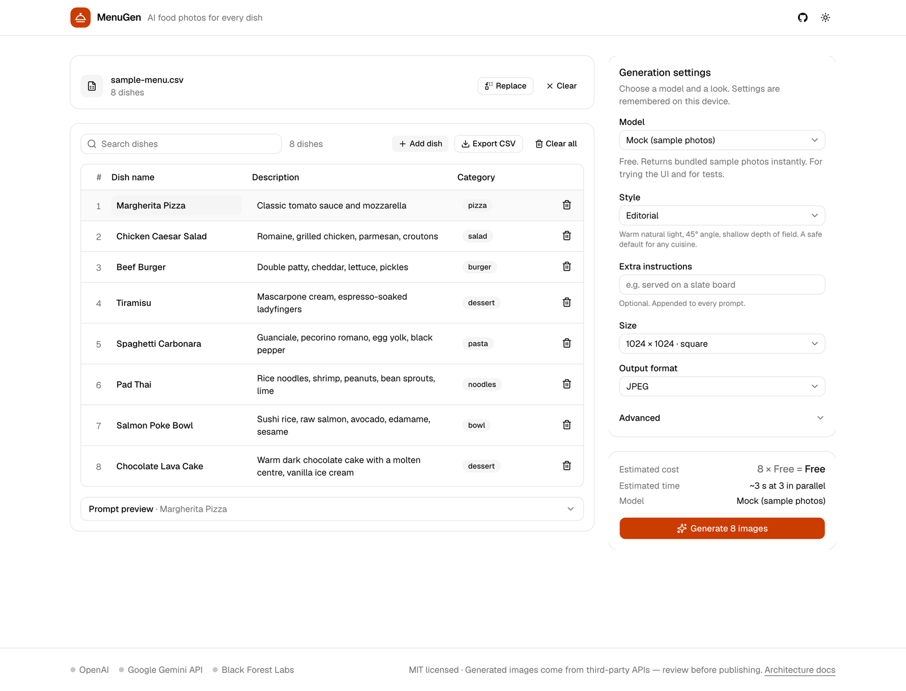
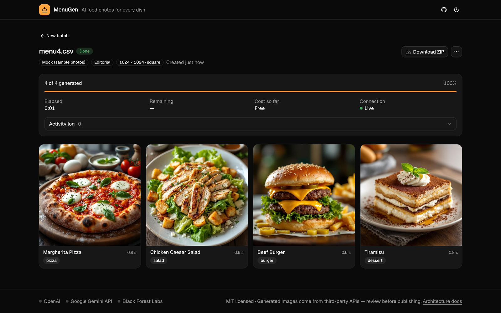
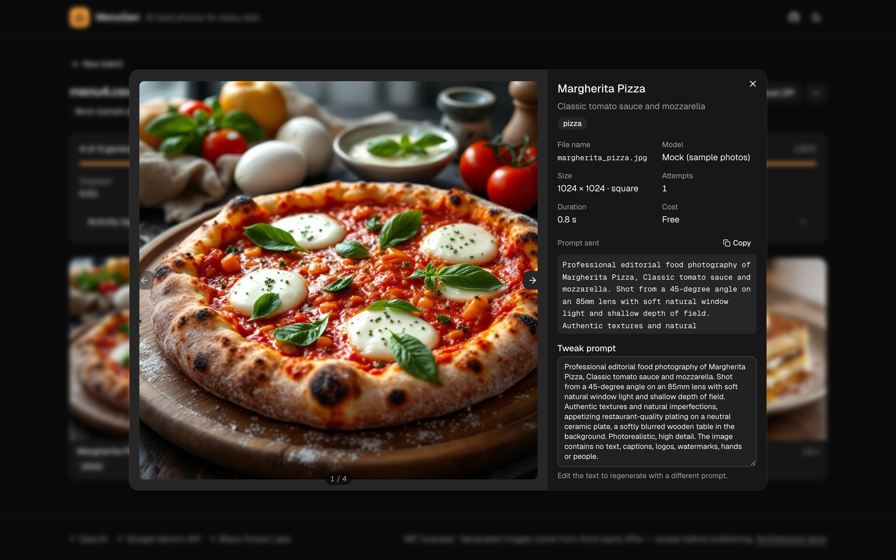
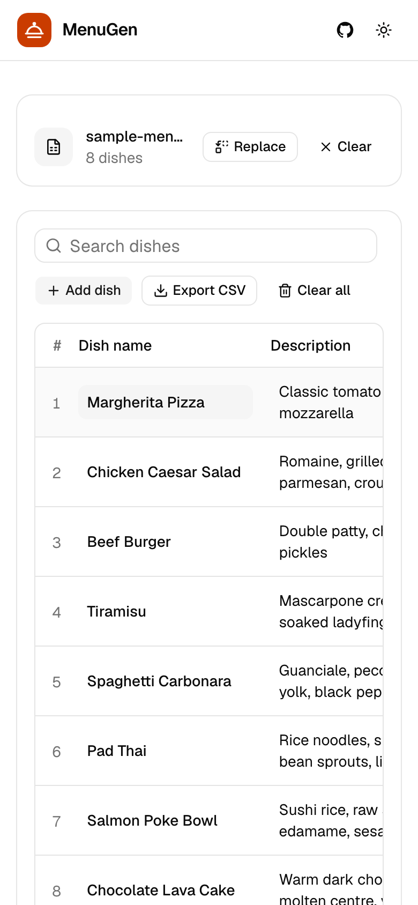

<p align="center">
  
</p>

<h1 align="center">MenuGen</h1>

<p align="center">
  Turn a menu spreadsheet into restaurant-quality AI food photos, one image per dish.<br>
  Upload a CSV, pick a model, download a ZIP.
</p>

<p align="center">
  <a href="LICENSE"></a>
  
  
  
</p>

<p align="center">
  
</p>

---

## Why

Menus without photos convert badly, but photographing every dish is slow and expensive. MenuGen started as an internal tool that produced placeholder photos for newly onboarded restaurants until their real photos arrived. This is the open-source rewrite:

- **Batch by design.** Drop a CSV or Excel file with hundreds of dishes, get a ZIP of consistently styled, correctly named images plus a `manifest.csv` for traceability.
- **Cheap and direct.** MenuGen calls OpenAI, Google Gemini and Black Forest Labs directly with your own keys. No aggregator markup, no extra account. The default model costs about **$0.03 per photo**; the cheapest is **$0.015**.
- **Review before you ship.** Live progress, a gallery, one-click regeneration with an editable prompt, retry of failures, and a persistent job history.

## Screenshots

| Compose: upload, review the table, choose a model | Results: live progress and gallery |
| --- | --- |
|  |  |

| Lightbox with prompt and regenerate | Mobile |
| --- | --- |
|  |  |

## Quick start

```bash
git clone https://github.com/albertobarnabo/MenuGen.git
cd MenuGen
npm install
cp .env.example .env      # add at least one API key (see below)
npm run dev               # http://localhost:3000
```

No key yet? The UI shows a free **Mock** model that returns bundled sample photos, so you can try the whole flow first.

### API keys

Set one or more of these in `.env`. Keys are read on the server only and never sent to the browser.

| Variable | Provider | Get a key |
| --- | --- | --- |
| `BFL_API_KEY` | Black Forest Labs (FLUX.2) | https://dashboard.bfl.ai |
| `OPENAI_API_KEY` | OpenAI (GPT Image 2) | https://platform.openai.com/api-keys |
| `GEMINI_API_KEY` | Google Gemini API (Nano Banana 2) | https://aistudio.google.com/apikey |

## Models and prices

Prices are USD per 1024×1024 image, taken from each vendor's public pricing page (September 2026). The model picker shows the same numbers and the total before you generate.

| Model | Provider | Price | Notes |
| --- | --- | --- | --- |
| **FLUX.2 [pro]** (default) | Black Forest Labs | $0.030 | Production photorealism, strong on food and product shots. Prepaid credits, no verification step. |
| FLUX.2 [klein] 9B | Black Forest Labs | $0.015 | Cheapest option that still produces usable menu tiles. Sub-second. |
| FLUX.2 [max] | Black Forest Labs | $0.070 | Highest-quality FLUX tier for hero shots. |
| GPT Image 2 | OpenAI | ≈ $0.008 / $0.032 / $0.125 | Low / medium / high quality. Token-billed, so these are estimates; MenuGen records the real cost from each response. Requires organisation verification. |
| Gemini 3.1 Flash Lite Image | Google | $0.034 | Fastest option (a few seconds). Billing must be enabled. |
| Gemini 3.1 Flash Image | Google | $0.067 | "Nano Banana 2", Google's quality tier. |
| Mock | – | Free | Bundled sample photos. For trying the UI and for tests. |

A 100-dish menu therefore costs about **$3** with the default model and **$1.50** with the cheapest one. Landscape and portrait sizes are available for every model; OpenAI bills them roughly 1.5×.

## Input format

CSV, TSV or Excel (`.xlsx`, `.xls`). Column names are case-insensitive and common aliases are accepted (`name`, `item`, `desc`, `ingredients`, `section`, …).

| Column | Required | Example |
| --- | --- | --- |
| `dish_name` | yes | Margherita Pizza |
| `description` | no | Classic tomato sauce and mozzarella |
| `category` | no | pizza |

A ready-made example is in [`sample_input.csv`](sample_input.csv) and available from the UI via **Use sample menu**.

## Output

A ZIP archive named `menugen_<file>_<batch>.zip` containing:

```
margherita_pizza.jpg
chicken_caesar_salad.jpg
beef_burger.jpg
…
manifest.csv     filename, dish, description, category, status, error, attempts, model, prompt, cost, timestamps
prompts.txt      the exact prompt used for every image
```

File names are derived from the dish name (`Crème Brûlée!` → `creme_brulee.jpg`) and de-duplicated. Output format (JPEG, PNG or WebP) and size are chosen per batch.

## Styles

Four built-in prompt presets plus a custom template with `{subject}`, `{dish_name}`, `{description}` and `{category}` placeholders:

- **Editorial** (default): warm natural light, 45° angle, shallow depth of field.
- **Delivery app**: top-down on a clean light background, consistent tiles.
- **Rustic & moody**: dark wood, dramatic side light.
- **Bright & minimal**: airy, high-key, pastel tones.

The prompt preview under the table shows exactly what will be sent for the first dish.

## Command line

Everything the UI does is available from a CLI that shares the same engine:

```bash
npm run cli -- models                      # list models, prices and which keys are configured
npm run cli -- generate -i menu.csv         # default model, asks for confirmation
npm run cli -- generate -i menu.xlsx -m bfl/flux-2-klein-9b --style delivery-clean \
    --size 1344x768 --format webp --concurrency 4 -o ./output --yes
```

Batches created from the CLI also show up in the web UI, so you can review and regenerate individual dishes afterwards.

## Configuration

| Variable | Default | Purpose |
| --- | --- | --- |
| `MENUGEN_DATA_DIR` | `./data` | Where batches, images and ZIPs are stored (gitignored) |
| `MENUGEN_MAX_ITEMS_PER_JOB` | `500` | Safety cap on rows per batch |
| `MENUGEN_DEFAULT_MODEL` | `bfl/flux-2-pro` | Pre-selected model |
| `MENUGEN_ENABLE_MOCK` | `false` | Always list the Mock model (it is listed automatically when no key is configured) |
| `OPENAI_BASE_URL`, `GEMINI_BASE_URL`, `BFL_BASE_URL` | vendor defaults | Proxies or regional endpoints |

## Deploy

MenuGen is a regular Node.js server. Batches run in the background of that process, so it needs a long-lived host rather than a serverless function.

```bash
docker compose up --build     # http://localhost:3000, data persisted in a named volume
```

Or without Docker: `npm run build && npm start`.

## How it works

```
browser ──parse CSV/XLSX──▶ editable table ──POST /api/jobs──▶ job store (data/jobs/<id>/job.json)
   ▲                                                              │
   └── SSE /api/jobs/:id/events ◀── runner: pool + retries ◀──────┘
                                        │
                     provider adapters: OpenAI · Gemini · BFL (plain fetch)
                                        │
                              sharp (format/size) ─▶ images/ ─▶ ZIP + manifest
```

- **Provider adapters** (`src/lib/providers/`) are small, dependency-free `fetch` clients. Adding a vendor means implementing one interface and adding registry entries.
- **The job runner** (`src/lib/jobs/`) bounds concurrency per batch, retries transient errors with exponential back-off and honours `Retry-After`, persists after every item, and streams events over SSE.
- **Everything shares one contract** (`src/lib/types.ts`), so the UI, API and CLI cannot drift apart.

Details in [docs/ARCHITECTURE.md](docs/ARCHITECTURE.md).

## Development

```bash
npm run dev          # Next.js dev server
npm test             # vitest unit + API tests (no network, uses the mock provider)
npm run typecheck    # tsc --noEmit
npm run lint         # eslint
npm run build        # production build (standalone output)
```

Stack: Next.js 16 (App Router), React 19, TypeScript, Tailwind CSS v4, shadcn/ui, sharp, archiver, zod, vitest.

## Good to know

- Generated images come from third-party models. Review them before publishing and check each vendor's usage terms. Google's models embed an invisible SynthID watermark.
- OpenAI's image models require a one-time organisation verification in the OpenAI dashboard; the API returns 403 until it is done.
- Your API keys stay in `.env` on the server. The browser only learns whether a provider is configured.

## License

[MIT](LICENSE)
